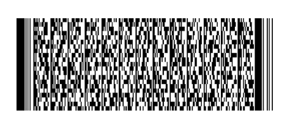

# IDL Parser for C/C++

Single-file header library to parse an
[International Driver License][idl] (IDL).

## Barcode

IDLs are usually encoded in a [PDF417][pdf417] barcode.

Reading this barcode is not part of this library.

## How to use

Before you include the header file in *one* C or C++ file, you need to define
`IDL_PARSER_IMPLEMENTATION` to create the implementation:

	#define IDL_PARSER_IMPLEMENTATION
	#include "idlparser.h"

## How to parse an IDL

Then invoke `parse_idl()` with IDL data:

	IDL idl;
	if (!parse_idl(&idl, data)) {
		fprintf(stderr, "error: failed to parse IDL\n");
		free_idl(&idl);
	}

Now the structure `idl` contains the parsed elements of the IDL:

	printf("IIN:[%s]\n", idl.iin);
	for (unsigned int i = 0; i < idl.count; ++i) {
		IDLElement *e = idl.elements + i;
		printf("%s:[%s]\n", e->key, e->value);
	}
	free_idl(&idl);

[idl]: http://www.aamva.org/DL-ID-Card-Design-Standard/
[pdf417]: https://en.wikipedia.org/wiki/PDF417
